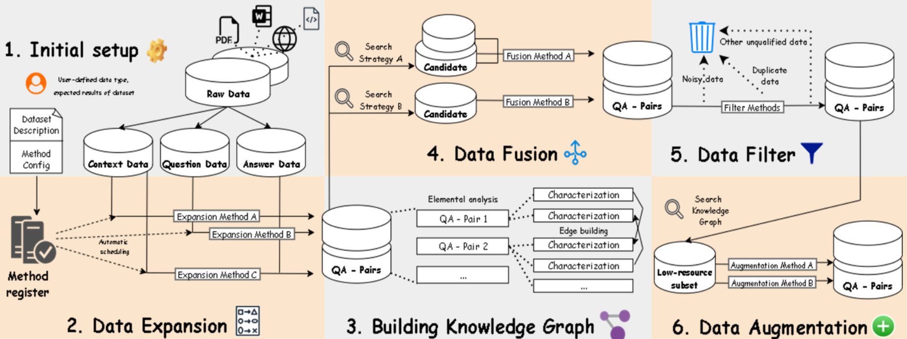
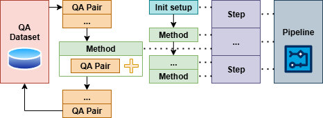

# AutoQA-Gen: Scalable QA Dataset Generation Framework

[](https://docs.google.com/presentation/d/1Ga9ogwiEXKRqdqsDmR9rGu8m2F2ue6CkTfkjj6or3L4/edit?usp=sharing)

AutoQA-Gen is a modular and extensible framework for generating high-quality question-answer (QA) datasets from raw text data. It addresses the challenges of limited flexibility, high annotation costs, and lack of systematic quality control in QA dataset creation.

## Table of Contents

- [Problem Statement](#problem-statement)
- [System Architecture](#system-architecture)
- [Installation](#installation)
- [Quick Start](#quick-start)
- [Core Data Structures](#core-data-structures)
- [Usage Examples](#usage-examples)
- [Custom Method Development](#custom-method-development)
- [Configuration](#configuration)
- [Advanced Features](#advanced-features)
- [Contributing](#contributing)

## Problem Statement

Creating high-quality QA datasets faces several challenges:

- **Limited Flexibility**: Most methods are tightly coupled to specific tasks or domains
- **High Development Costs**: Manual annotation and pipeline redesign for new datasets
- **Quality Control Issues**: Lack of systematic quality assurance in generated QA pairs
- **Scalability Problems**: Difficulty handling large-scale dataset generation

AutoQA-Gen solves these challenges with a standardized, modular pipeline that maintains flexibility for domain-specific customization.

## System Architecture



AutoQA-Gen transforms raw data into high-quality QA pairs through a six-stage modular pipeline:

1. **Initialization** – Input setup and preprocessing
2. **Data Expansion** – Converting raw text into structured QA pairs
3. **Knowledge Graph Construction** – Building relationships between QA pairs
4. **Data Fusion** – Combining multiple data sources
5. **Data Filtering** – Quality control and redundancy removal
6. **Data Augmentation** – Expanding and diversifying QA pairs

## Installation

```bash
git clone https://github.com/SUNGOD3/QA_pair_generator.git
cd QA_pair_generator
pip install -r requirements.txt
```

### Prerequisites

- Python 3.8+
- For LLM-based methods: [Ollama](https://github.com/ollama/ollama) or [OpenAI API key](https://platform.openai.com/api-keys)

## Quick Start

Here's a minimal example to get you started:

```python
from QA_GEN import Pipeline, QADataset, QAPair

# Create a pipeline
pipeline = Pipeline()

# Create a dataset
dataset = QADataset(description="Simple QA dataset example")

# Add some data
dataset.add(QAPair(context="Artificial Intelligence (AI) is the simulation of human intelligence in machines."))
dataset.add(QAPair(context="Machine learning is a subset of AI that focuses on algorithms."))

# Configure the pipeline
config = {
    'auto_config': False,
    'methods_to_run': ["paq_QA_generation"],  # Specify which methods to use
}

# Run the pipeline
processed_dataset = pipeline.run(dataset, config)

# View results
for qa_pair in processed_dataset:
    print(f"Context: {qa_pair.context}")
    print(f"Question: {qa_pair.question}")
    print(f"Answer: {qa_pair.answer}")
    print("---")
```

## Core Data Structures



### QAPair

The fundamental unit representing a question-answer pair with optional context:

```python
class QAPair:
    def __init__(self, context=None, question=None, answer=None, metadata=None):
        self.context = context      # Background text/document
        self.question = question    # The question
        self.answer = answer       # The answer
        self.edges = []           # Relationships to other QAPairs
        self.metadata = metadata  # Additional information
```

**QAPair Types:**
- `Document` (1): Only context
- `Question` (2): Only question
- `Ground Truth` (4): Only answer
- `Context + Question` (3): Context and question
- `Context + Ground Truth` (5): Context and answer
- `QA Pair` (6): Question and answer
- `Complete QA` (7): All three components

### QADataset

A collection of QAPairs with management capabilities:

```python
dataset = QADataset(
    name="my_dataset",
    description="Dataset description",
    use_disk=True,  # Enable disk storage for large datasets
    disk_path="./storage"
)

# Basic operations
dataset.add(qa_pair)           # Add a QAPair
dataset.get(id)                # Retrieve by ID
dataset.edit(id, new_qa_pair)  # Edit existing QAPair
dataset.delete([id1, id2])     # Delete QAPairs
dataset.filter_by_type("QA Pair")  # Filter by type
```

### Pipeline

The main processing engine that orchestrates the entire workflow:

```python
# Create pipeline with custom stages
pipeline = Pipeline(stages=["data_expansion", "data_filter"])

# Or use all default stages
pipeline = Pipeline()
```

## Usage Examples

### Working with TSV Files

```python
import csv
from QA_GEN import Pipeline, QADataset, QAPair

# Load data from TSV file
dataset = QADataset(description="Dataset from TSV file")

with open('data/passages.tsv', 'r', encoding='utf-8') as f:
    reader = csv.DictReader(f, delimiter='\t')
    for row in reader:
        dataset.add(QAPair(context=row['text']))

# Process with specific methods
config = {
    'auto_config': False,
    'methods_to_run': ["paq_QA_generation", "quality_filter"]
}

processed_dataset = pipeline.run(dataset, config)
```

### Large Dataset Processing

```python
# Enable disk storage for large datasets
large_dataset = QADataset(
    name="large_dataset",
    use_disk=True,  # Enable disk-based processing
    disk_path="./large_dataset_storage"
)

# Add thousands of documents
for document in large_document_collection:
    large_dataset.add(QAPair(context=document))

# Process with automatic cleanup
pipeline = Pipeline()
processed = pipeline.run(large_dataset, config)

# Clean up disk storage when done
pipeline.cleanup_disk_storage(large_dataset)
```

### Custom Configuration

```python
config = {
    'auto_config': True,  # Automatically select methods
    'use_llm_for_method_selection': True,  # Use LLM for method selection
    'max_visualization_size': 500,  # Limit graph visualization
    'quality_threshold': 0.7,  # Quality filtering threshold
    'methods_to_run': [  # Manual method selection
        "paq_QA_generation",
        "similarity_filter",
        "augment_paraphrase"
    ]
}
```

## Custom Method Development

You can easily extend AutoQA-Gen by creating custom methods. Methods are automatically discovered from the `methods/` directory.

### Creating a Custom Method

1. Create a new Python file in the `methods/` directory:

```python
# methods/my_custom_method.py
from QA_GEN.method_register import Method

@Method(
    name="my_custom_method",
    description="Description of what this method does",
    applicable_stages=["data_expansion"],  # Which stages can use this method
    use_LLM=False,  # Whether this method requires LLM
    use_docker=False  # Whether this method requires Docker
)
def my_custom_method(qa_pairs, config):
    """
    Custom method implementation.
    
    Args:
        qa_pairs: List of QAPair objects
        config: Configuration dictionary
    
    Returns:
        List of QAPair objects (for expansion methods)
        or Modified dataset (for other methods)
    """
    processed_pairs = []
    
    for qa_pair in qa_pairs:
        # Your custom logic here
        if qa_pair.context:
            # Example: Create a simple question from context
            question = f"What is mentioned about {qa_pair.context[:50]}?"
            answer = qa_pair.context[:100]
            
            new_pair = QAPair(
                context=qa_pair.context,
                question=question,
                answer=answer
            )
            processed_pairs.append(new_pair)
    
    return processed_pairs
```

2. The method will be automatically discovered and available in the pipeline:

```python
config = {
    'methods_to_run': ["my_custom_method"]
}
```

### Method Registration System

The framework uses a decorator-based method registration system:

- **`name`**: Unique identifier for the method
- **`description`**: What the method does
- **`applicable_stages`**: List of pipeline stages where this method can be used
- **`use_LLM`**: Whether the method requires language model access
- **`use_docker`**: Whether the method requires Docker environment

### Method Types by Stage

**Data Expansion Methods**: Return list of new QAPair objects
**Filter Methods**: Return modified QADataset with filtered content
**Augmentation Methods**: Return QADataset with additional QA pairs
**Fusion Methods**: Return QADataset with merged/combined content

## Configuration

### Basic Configuration Options

```python
config = {
    # Method Selection
    'auto_config': True,  # Auto-select methods based on dataset
    'methods_to_run': [],  # Manually specify methods to use
    'use_llm_for_method_selection': False,  # Use LLM for method selection
    
    # Processing Options
    'max_visualization_size': 1000,  # Skip visualization if dataset too large
    'batch_size': 100,  # Processing batch size
    
    # Quality Control
    'quality_threshold': 0.5,  # Minimum quality score
    'min_question_length': 10,  # Minimum question length
    'max_question_length': 200,  # Maximum question length
    
    # LLM Settings (if using LLM methods)
    'llm_model': 'gpt-3.5-turbo',  # LLM model to use
    'temperature': 0.7,  # LLM temperature
    'max_tokens': 150,  # Maximum tokens per generation
}
```

### Environment Variables

```bash
# For OpenAI-based methods
export OPENAI_API_KEY="your_api_key_here"

# For Ollama-based methods (make sure Ollama is running)
ollama serve
```

## Advanced Features

### Disk-Based Processing

For large datasets, enable disk storage to avoid memory issues:

```python
dataset = QADataset(use_disk=True, disk_path="./storage")
```

This enables:
- Automatic saving/loading between pipeline stages
- Memory-efficient processing of large datasets
- Resume capability if processing is interrupted

### Graph Visualization

The framework automatically builds knowledge graphs showing relationships between QA pairs:

```python
# Visualizations are created automatically during knowledge graph construction
# Files saved: cosine_similarity_graph.png, keyword_overlap_graph.png, combined_graph.png
```

### Method Validation

```python
# Validate all loaded methods
pipeline = Pipeline()
validation_results = pipeline.method_registry.validate_methods()

print("Valid methods:", validation_results["valid"])
print("Errors:", validation_results["errors"])
print("Warnings:", validation_results["warnings"])
```

### Performance Monitoring

```python
# Get dataset statistics
stats = dataset.get_statistics()
print("Dataset composition:", stats)

# Monitor disk usage
if dataset.use_disk:
    usage_info = pipeline.get_disk_usage(dataset)
    print("Disk usage:", usage_info)
```

## Contributing

We welcome contributions! Here's how to get started:

1. **Fork the repository**
2. **Create a feature branch**: `git checkout -b feature/your-method`
3. **Add your method** in the `methods/` directory following the template above
4. **Test your method** with the existing pipeline
5. **Submit a pull request** with a clear description

### Guidelines for Method Development

- Use descriptive method names and comprehensive descriptions
- Include proper error handling
- Add docstrings following the established format
- Test with various dataset sizes and types
- Consider memory efficiency for large datasets

## License

This project is licensed under the MIT License - see the [LICENSE](LICENSE) file for details.

## Citation

If you use AutoQA-Gen in your research, please cite:

```bibtex
@software{autoqa_gen,
  title={AutoQA-Gen: Scalable QA Dataset Generation Framework},
  author={Tai-Yang, Huang},
  year={2025},
  url={https://github.com/SUNGOD3/QA_pair_generator}
}
```

## Support

- **Issues**: Report bugs and request features via [GitHub Issues](https://github.com/SUNGOD3/QA_pair_generator/issues)
- **Documentation**: Check the [Google Slides presentation](https://docs.google.com/presentation/d/1Ga9ogwiEXKRqdqsDmR9rGu8m2F2ue6CkTfkjj6or3L4/edit?usp=sharing)
- **Examples**: See `demo.py`, `demo_boolQ/`, and `PAQ_demo/` for usage examples

---

**Ready to generate high-quality QA datasets?** Start with the Quick Start guide above and explore the examples in the repository!
